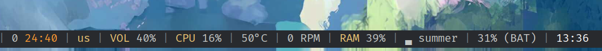

The Pomodoro timer is an applet for [Polybar](https://github.com/polybar/polybar).

<p align="center">
    <br>
        
        
    <br>
</p>

## Features

- format: [completed_pomodoros time] see pictures above on the left
    - [ 0 24:40 ] - work
    - [ 0 00:04 ] - break
- 25-minute work sessions
- 5-minute short breaks
- 15-minute long breaks after 4 pomodoros
- Color-coded display (orange for work, green for breaks)
- Click controls: start/pause,  reset, skip
- Desktop notifications
- Sound alerts

## Installation

1. Dependancies

```
Python 3, notify2, polybar, [optional] libcanberr 
```

1. Clone the repository

```bash
git clone https://github.com/kirillin/polybar-pomodoro.git
```

2. Add module to Polybar `~/.config/polybar/config`

```
[module/pomodoro]
type = custom/script
exec = python3 ~/polybar-pomodoro/pomodoro.py
click-left = python3 ~/polybar-pomodoro/pomodoro.py toggle
click-middle = python3 ~/polybar-pomodoro/pomodoro.py reset
click-right = python3 ~/polybar-pomodoro/pomodoro.py skip
tail = true
```

## Usage

- Left click: Start/pause timer

- Middle click: Reset timer

- Right click: Skip current period