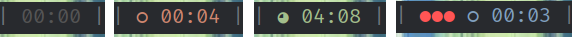

The Pomodoro timer is an applet for [Polybar](https://github.com/polybar/polybar).

<p align="center">
    <br>
         
    <br>
</p>

## Features

- pomodoro
    - format: `[completed_pomodoros current_pomodoro time]` see pictures above
        - [      00:00 ] - idle
        - [    ◔ 08:13 ] - work
        - [    ◑ 02:42 ] - break
        - [ ●● ◔ 07:50] - completed two pomodoros
    - 25-minute work sessions
    - 5-minute short breaks
    - 15-minute long breaks after 4 pomodoros
    - Color-coded display (orange for work, green for break, blue for long break)
    - Click controls: start/pause,  reset, skip
    - Desktop notifications
    - Sound alerts
<!-- - bartimer (last picture above)
    - Simple timer
    - Click controls: start/pause,  reset
    - Notify you every 10 minutes
    - Change color to more red every 20 minutes -->

## Installation

1. Dependancies

```
Python 3, notify2, polybar, [optional] libcanberr 
```

1. Clone the repository

```bash
git clone https://github.com/kirillin/polybar-pomodoro.git
```

2. Add module to Polybar `~/.config/polybar/config`

```
[module/pomodoro]
type = custom/script
exec = python3 ~/polybar-pomodoro/pomodoro.py
click-left = python3 ~/polybar-pomodoro/pomodoro.py toggle
click-middle = python3 ~/polybar-pomodoro/pomodoro.py reset
click-right = python3 ~/polybar-pomodoro/pomodoro.py skip
tail = true
```

## Usage

- Left click: Start/pause timer

- Middle click: Reset timer

- Right click: Skip current period